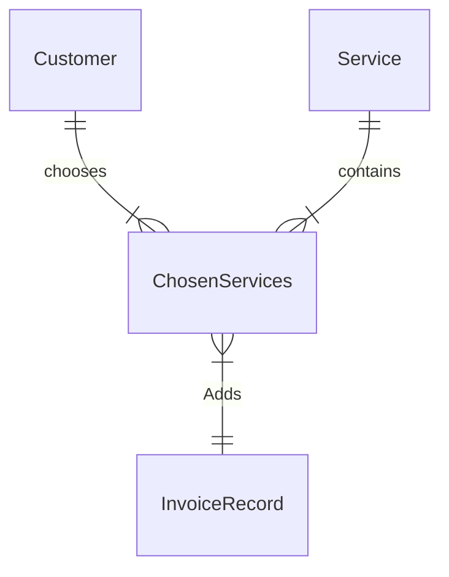

Ticket 003: Create a SQL Server Database with 4 Tables
=======================

At the early stage of the development, the program requires a SQL Server database created for the invoice application project. This SQL server database will provide to create 4 relational database tables and use it to store important details of the invoices. 

This ticket is vital as other tickets will need to use it for inserting, selecting and updating records in the program. Also, it would used for future tickets that will create reports to analyse the business progress. 

Related Tickets
---------------
* Requierd depedencies
    * [001](./001.md) - Main Menu
    * [002](./002.md) - Invoice Form Interface


Coditions of Success
--------------------
*  Add a new item in the solution project and create "Service based database"
    *  Name the item as "InvoiceDatabase.mdf"
*  Create 4 tables
    * Customer
    * Service
    * ChosenServices
    * InvoiceRecord

* Use appropriate data type for each field 
    * (check technical notes for more information)

* Add at least 2-3 sample data for all table to test.


Techical Notes
--------------
* Visual studio must have Visual C# item "Service-based Database"
* Use Visual studio Community 2019 Version 16.2.5


* **Entity Relational Diagram**



* **Logical ER Model**


* Sample ServiceChosen table record


| serviceChosenId | serviceId | customerId | invoiceRecordId |
| -------- | -------- | -------- | ------- | ------------ |
|     0     | 1     | 1     |     2000   |
|     1     | 2     | 1     |     2000   |
|     2     | 1     | 2     |     2001   |


* Sample Query to get the specific customer on specific invoice record
```sql=
SELECT serviceID, customerID, invoiceID

WHERE customerID == 1 && invoiceID = 2000
```


Size + Engerineg notes
----------------------
| Size | Engineering notes | 
| -------- | -------- |
| **2**    | To create the SQL server database and 4 tables for the solution project can be done quickly. The difficult part is learning how to connect the SQL database server into c# code and testing whether the tables do update. | 
