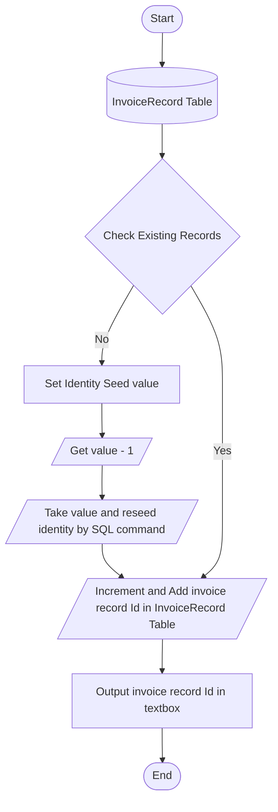

Ticket 004:  Auto Fill Header Items
=======================

This ticket is part of the Invoice form and it automatically populates the items of the header such as the invoice number and the date. Having this feature lets the user do without the need to enter the data manually which creates invoices quickly. 

Related Tickets
---------------

* Requierd depedencies
    * [001](./001.md) - Main Menu
    * [002](./002.md) - Invoice Form window
    * [003](./003.md) - Data Store

Coditions of Success
--------------------

* Once the Invoce form is displayed, the user must be able to see the date value as the current date.

* When the Invoice form is displayed, the invoice number value must be the increment of the recent invoice number based from the database.  For example, if the invoice number is 2000 from the database then the form must increment by 1 and display 2001.

Techical Notes
--------------

* Flow chart of creating invoice record Id

* When the Id is created, it must be saved in the InvoiceRecord table records with the current date.

* Ensure to add the data source to get the connection string from the database.

* Make sure to add reference "System.Configuration" and "System.Data.SqlClient" libraries into the project so to able to connect to the SQL Database.

Size + Engerineg notes
----------------------
| Size | Engineering notes | 
| -------- | -------- |
| **3**    | SQL server is quiet new to the developer and will have to deal and test connection of database and using the right query to read the recent invoice number from the database. Dealing this ticket also manages of changing and incrementing invoice id record which using specific SQL statment must be taken note.  

